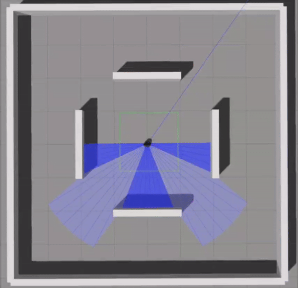

# End-to-end Motion Planner Using Proximal Policy Optimization (PPO) in Gazebo

The goal is to use deep reinforcement learning algorithms, specifically Proximal Policy Optimization (PPO), to control a mobile robot (TurtleBot) to avoid obstacles while navigating towards a target.

**Goal:** Enable the robot (TurtleBot) to navigate to the target (enter the yellow circle).

---

## 🐳 Docker Setup for Ubuntu 24.04 (GPU Accelerated)

**Prerequisites:** Docker, Docker Compose, NVIDIA GPU with drivers installed

### Quick Start

```bash
# 1. Install Docker and NVIDIA Container Toolkit (if needed)
sudo apt-get update && sudo apt-get install -y docker.io docker-compose-v2
curl -fsSL https://nvidia.github.io/libnvidia-container/gpgkey | sudo gpg --dearmor -o /usr/share/keyrings/nvidia-container-toolkit-keyring.gpg
curl -s -L https://nvidia.github.io/libnvidia-container/stable/deb/nvidia-container-toolkit.list | sed 's#deb https://#deb [signed-by=/usr/share/keyrings/nvidia-container-toolkit-keyring.gpg] https://#g' | sudo tee /etc/apt/sources.list.d/nvidia-container-toolkit.list
sudo apt-get update && sudo apt-get install -y nvidia-container-toolkit
sudo nvidia-ctk runtime configure --runtime=docker && sudo systemctl restart docker
sudo chmod 666 /var/run/docker.sock

# 2. Build and start container
docker compose build
docker compose up -d

# 3. Launch Gazebo simulation (headless)
docker exec -d navbot-ppo bash -c "source /opt/ros/noetic/setup.bash && source /root/catkin_ws/devel/setup.bash && roslaunch /tmp/turtlebot3_stage_1_headless.launch"

# 4. Run PPO training (in another terminal)
docker exec -it navbot-ppo bash
source /opt/ros/noetic/setup.bash && source /root/catkin_ws/devel/setup.bash
cd /root/catkin_ws/src/project_ppo/src
python3 main.py

# Monitor robot commands
docker exec navbot-ppo bash -c "source /opt/ros/noetic/setup.bash && rostopic echo /cmd_vel"
```

**Note:** The setup uses headless Gazebo (no GUI) to avoid X11 issues in Docker. The training runs with GPU acceleration automatically.

---


### Demo GIF

Watch a demonstration of our mapless motion planner in action (3x):



### Introduction

## Advancements in Technology and Service Robots

As technology progresses, the integration of service robots into our daily lives is becoming increasingly common. Service robots incorporate a multitude of key technologies from various fields, including mobile navigation, system control, mechanism modules, vision modules, voice modules, artificial intelligence, and other related technical fields. This research is particularly focused on developing indoor robot navigation techniques.

## Project Overview: Learning-Based Mapless Motion Planner

In this project, we introduce a learning-based mapless motion planner that utilizes sparse laser signals and the target's position in the robot frame (i.e., relative distance and angles) as inputs. This approach generates continuous steering commands as outputs, eliminating the need for traditional mapping methods like SLAM (Simultaneous Localization and Mapping). This innovative planner is capable of navigating without prior maps and can adapt to new environments it has never encountered before.

Our approach is inspired by advancements in reinforcement learning for robotic navigation, as detailed in our paper ["Reinforcement Learning Based Mapless Navigation in Dynamic Environments Using LiDAR" (arXiv:2405.16266)](https://arxiv.org/abs/2405.16266). This paper demonstrates the efficacy of deep reinforcement learning techniques in enabling robots to navigate complex, dynamic environments without relying on pre-built maps.

### Input Specifications (State):

The input features, forming a 16-dimensional state, include:

1. **Laser Finding (10 Dimensions)** - Represents sparse laser measurements.
2. **Past Action (2 Dimensions)**:
   - Linear velocity
   - Angular velocity
3. **Target Position in Robot Frame (2 Dimensions)**:
   - Relative distance
   - Relative angle (using polar coordinates)
4. **Robot Yaw Angular (1 Dimension)** - Indicates the robot's current yaw angle.
5. **Degrees to Face the Target (1 Dimension)** - The absolute difference between the yaw and the relative angle to the target.

### Normalization of Inputs:

Normalization is applied to the inputs to facilitate learning by scaling all values to a consistent range:

1. **Laser Finding** - Divided by the maximum laser finding range.
2. **Past Action** - Retained as original values.
3. **Target Position in Robot Frame**:
   - Relative distance normalized by the diagonal length of the map.
   - Relative angle normalized by 360 degrees.
4. **Robot Yaw Angular** - Normalized by 360 degrees.
5. **Degrees to Face the Target** - Normalized by 180 degrees.

### Output Specifications (Action):

The outputs, forming a 2-dimensional action, consist of:

1. **Linear Velocity (1 Dimension)** - Ranging from 0 to 0.25 meters per second.
2. **Angular Velocity (1 Dimension)** - Ranging from -0.5 to 0.5 radians per second.


## Reward System
- **Arrive at the target**: +120
- **Hit the wall**: -100
- **Move towards target**: 500 * (Past relative distance - Current relative distance)

## Algorithm
- **Proximal Policy Optimization (PPO)** using Actor and Critic methods, implemented with PyTorch.

## Training Environment
- **Gazebo**: A robot simulation environment, managed via Neotic and PyTorch for enhanced machine learning capabilities.

### Installation Dependencies:

1. **Python3**
2. **PyTorch**:
   ```bash
   pip3 install torch torchvision

3) ROS noetic

> http://wiki.ros.org/noetic/Installation/Ubuntu

4) Gazebo7 (When you install ros kinetic it also install gazebo7)

> http://gazebosim.org/tutorials?cat=install&tut=install_ubuntu&ver=7.0


# Installation

## Option 1: Docker Setup (Recommended for Ubuntu 24.04)

**For Ubuntu 24.04 users:** Since ROS1 cannot be installed natively on Ubuntu 24, use the Docker setup with browser-based Gazebo GUI.

📖 **See [DOCKER_SETUP.md](DOCKER_SETUP.md) for complete Docker installation and usage instructions.**

**Quick Start:**
```bash
# Build and start container
docker compose up -d

# Access container
docker exec -it navbot-ppo bash

# Open browser to http://localhost:6080 to view Gazebo GUI

# Inside container - Terminal 1:
roslaunch turtlebot3_gazebo turtlebot3_stage_1.launch

# Inside container - Terminal 2:
roslaunch project ppo_stage_1.launch
```

## Option 2: Native Installation (Ubuntu 20.04 only)

# Create and Initialize the Workspace
```bash
cd
mkdir -p catkin_ws/src && cd catkin_ws/src
git clone https://github.com/hamidthri/navbot_ppo.git project
git clone https://github.com/hamidthri/turtlebot3
git clone https://github.com/hamidthri/turtlebot3_msgs
git clone https://github.com/hamidthri/turtlebot3_simulations
cd ..
catkin_make
```

# Configure Environment
```bash
echo "export TURTLEBOT3_MODEL=burger" >> ~/.bashrc
echo "source /home/'Enter your user name'/catkin_ws/devel/setup.bash" >> ~/.bashrc
source ~/.bashrc
```

## Running the Demo
```bash
roslaunch turtlebot3_gazebo turtlebot3_stage_1.launch
```
## In another terminal
```bash
roslaunch project_ppo ppo_stage_1.launch
```

# Training Option
If you want to retrain the model, modify the following in the specified file:
```bash
is_training = True
```
Located in: project/src/ppo_stage_1.py

_______________________________________________________

### Reference:

#### Idea:
- [PPO Paper](https://arxiv.org/pdf/1703.00420.pdf)

#### ROS Workspace:
- [Turtlebot3 GitHub Repository](https://github.com/ROBOTIS-GIT/turtlebot3)
- [Turtlebot3 Messages Repository](https://github.com/ROBOTIS-GIT/turtlebot3_msgs)
- [Turtlebot3 Simulations Repository](https://github.com/ROBOTIS-GIT/turtlebot3_simulations)
- [Project GitHub Repository](https://github.com/dranaju/project)


This version keeps all the command line instructions within a single code block for simplicity and adds the installation command for PyTorch. Adjust the paths or any commands as necessary to accurately reflect your project setup and environment.

